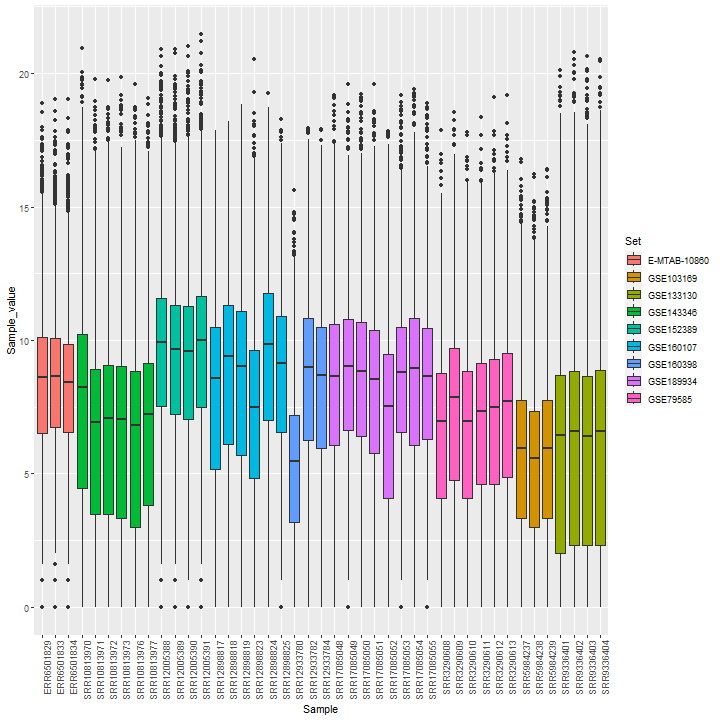
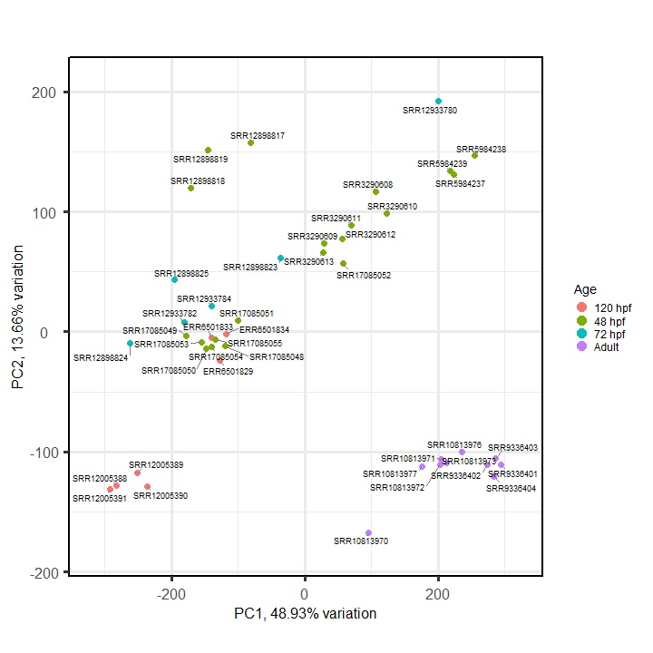
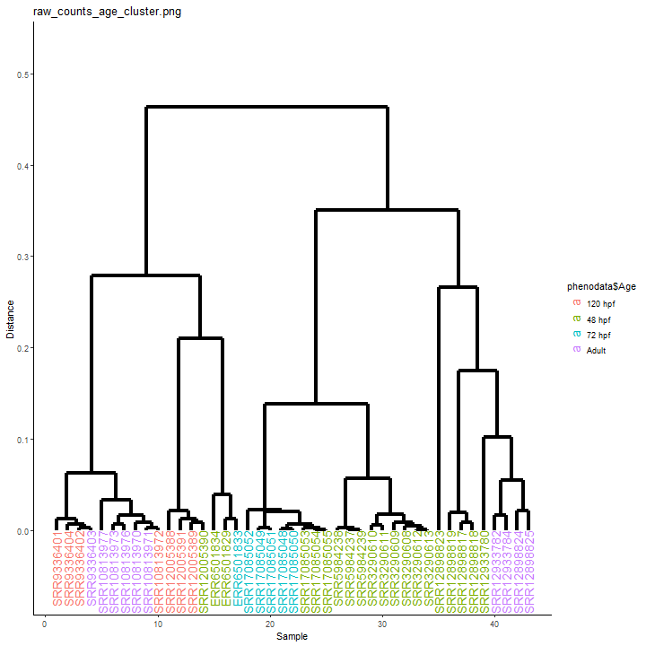
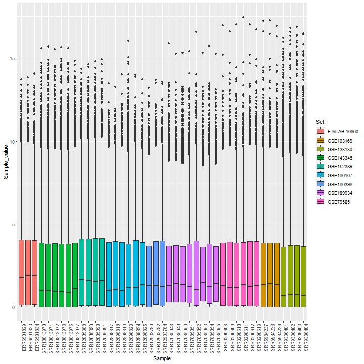
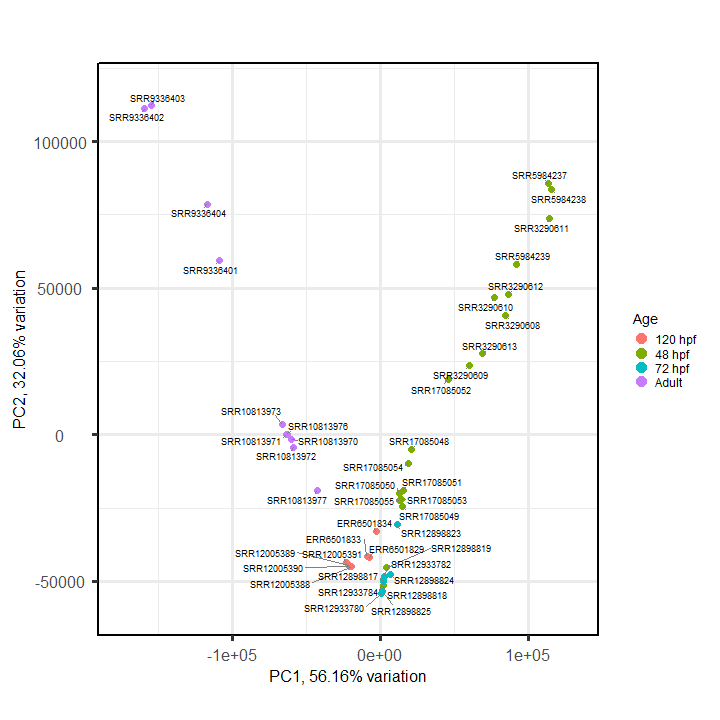
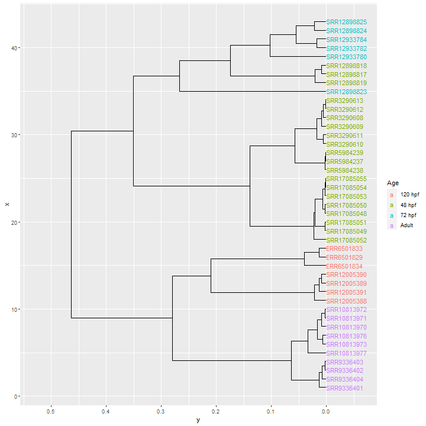
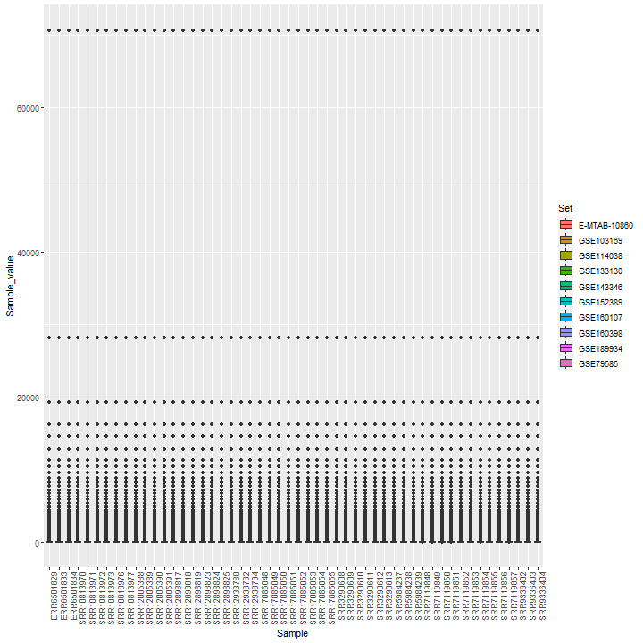
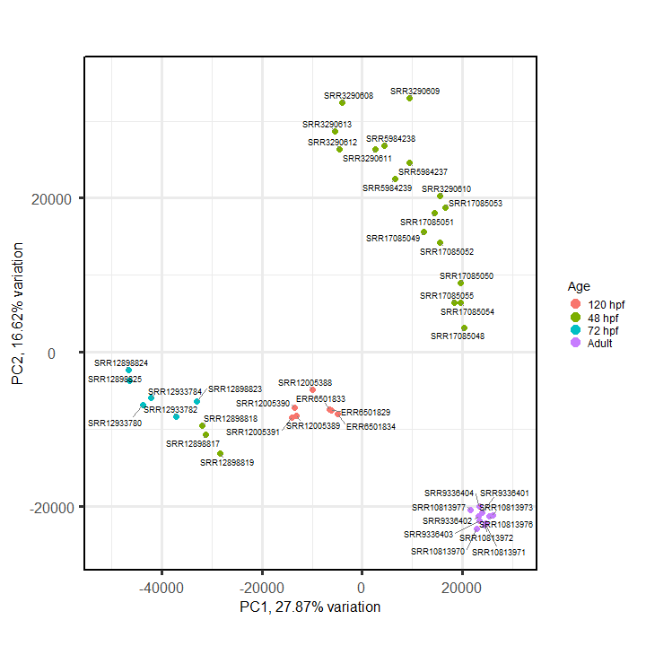

# Análisis exploratorio de los datos {.tabset}

## Conteos crudos {.tabset}

### Boxplot

```{r}

```

### PCA

```{r}

```

### Clustering

```{r}

```

## {-}

## Normalización por TMM {.tabset}

### Boxplot

```{r}

```

### PCA

```{r}

```

### Clustering

```{r}

```

## {-}

## Normalización por QN {.tabset}

### Boxplot

```{r}

```

### PCA

```{r}

```

### Clustering

```{r}
knitr::include_graphics("qn_counts_age_cluster.png")
```

## {-}