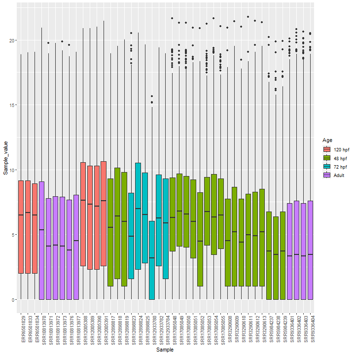
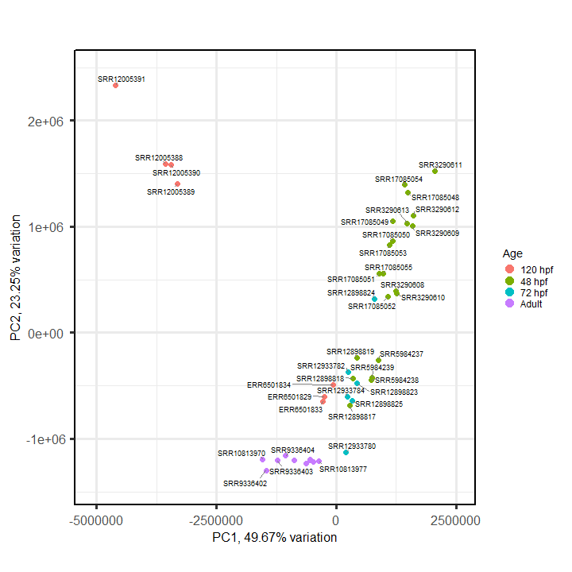
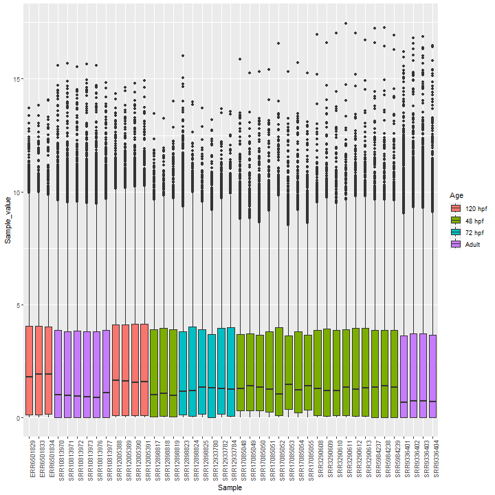
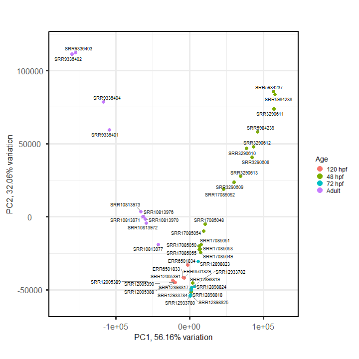
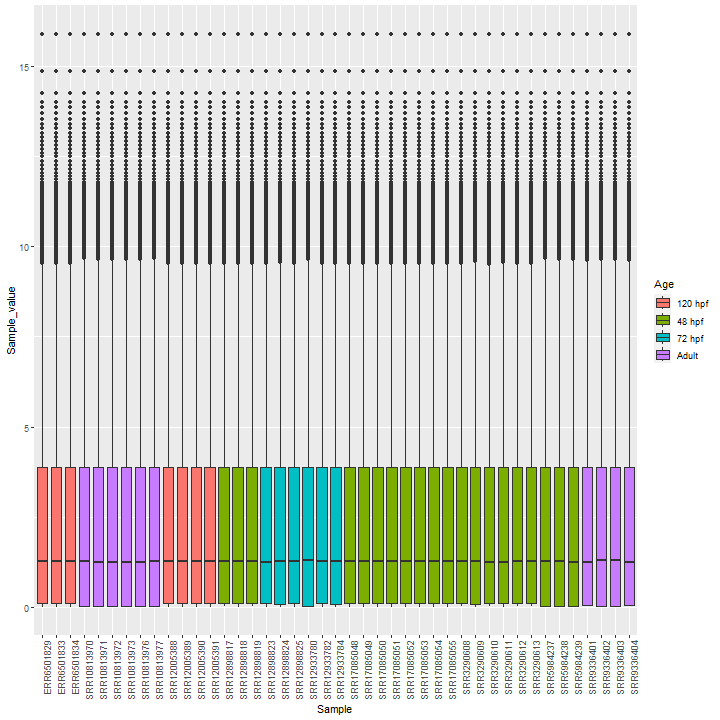
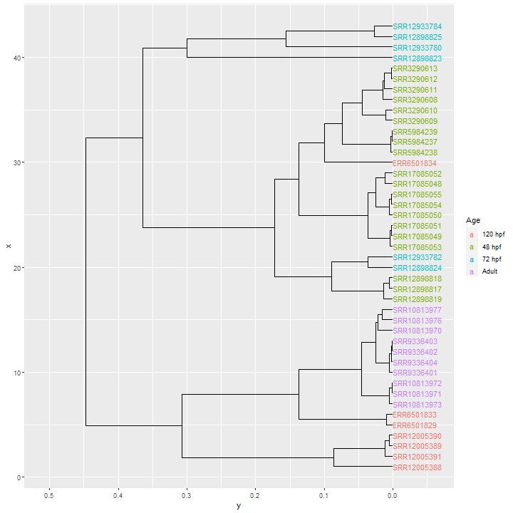

```{r setup, include=FALSE}
knitr::opts_chunk$set(echo = FALSE, out.width = "100%")
```


# Análisis exploratorio de los datos {.tabset}

## Conteos crudos {.tabset}

### Boxplot

```{r}

```

### PCA

```{r}

```

### Clustering

```{r}
knitr::include_graphics("raw_counts_age_cluster.png")
```

## {-}

## Normalización por TMM {.tabset}

### Boxplot

```{r}

```

### PCA

```{r}

```

### Clustering

```{r}

```

## {-}

## Normalización por QN {.tabset}

### Boxplot

```{r}

```

### PCA

```{r}
knitr::include_graphics("qn_counts_age_pca.png")
```

### Clustering

```{r}

```

## {-}