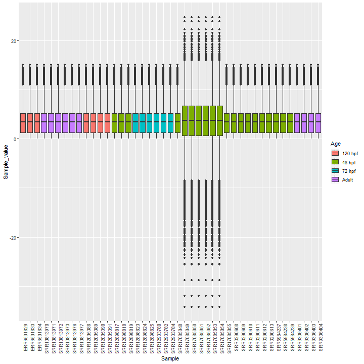
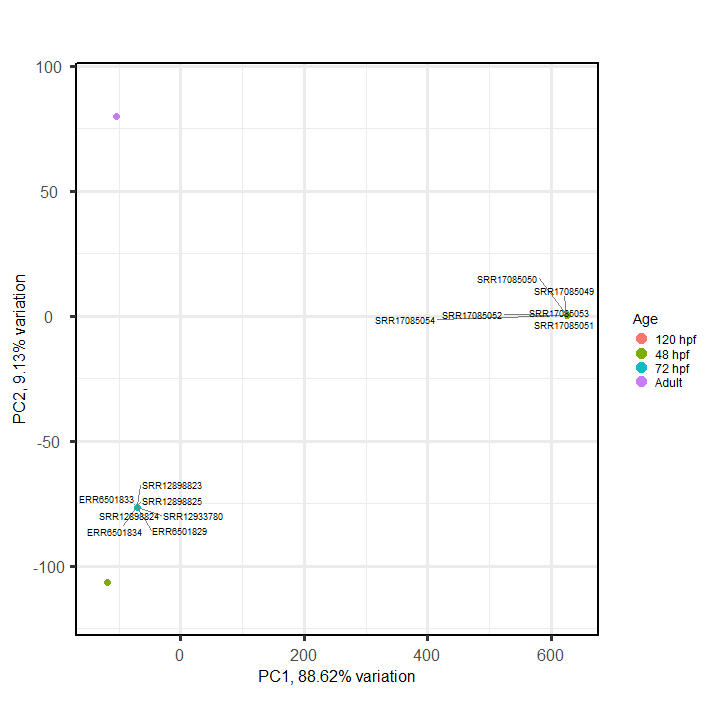
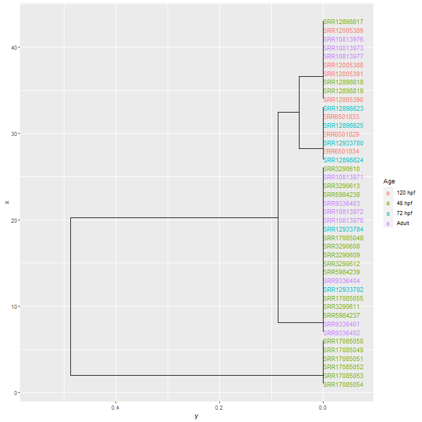
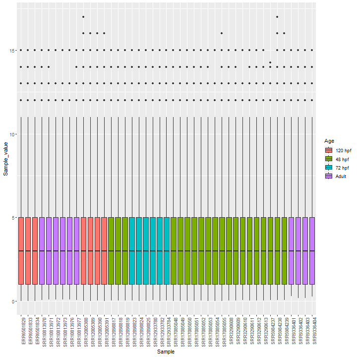
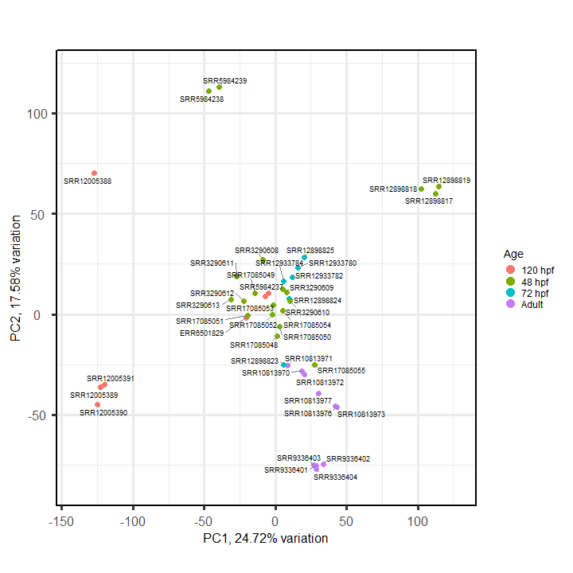
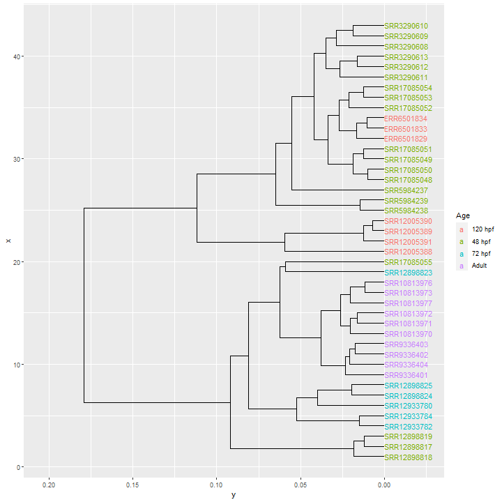

```{r setup, include=FALSE}
knitr::opts_chunk$set(echo = FALSE, out.width = '100%')
```

```{r packages}
require(dplyr)
require(DT)
```

## Corrección del efecto lote {.tabset}

### SVA {.tabset}

#### Boxplot

```{r}

```

#### PCA

```{r}

```

#### Cluster

```{r}

```

### ComBat {.tabset}

#### Boxplot

```{r}

```

#### PCA

```{r}

```

#### Cluster

```{r}

```

