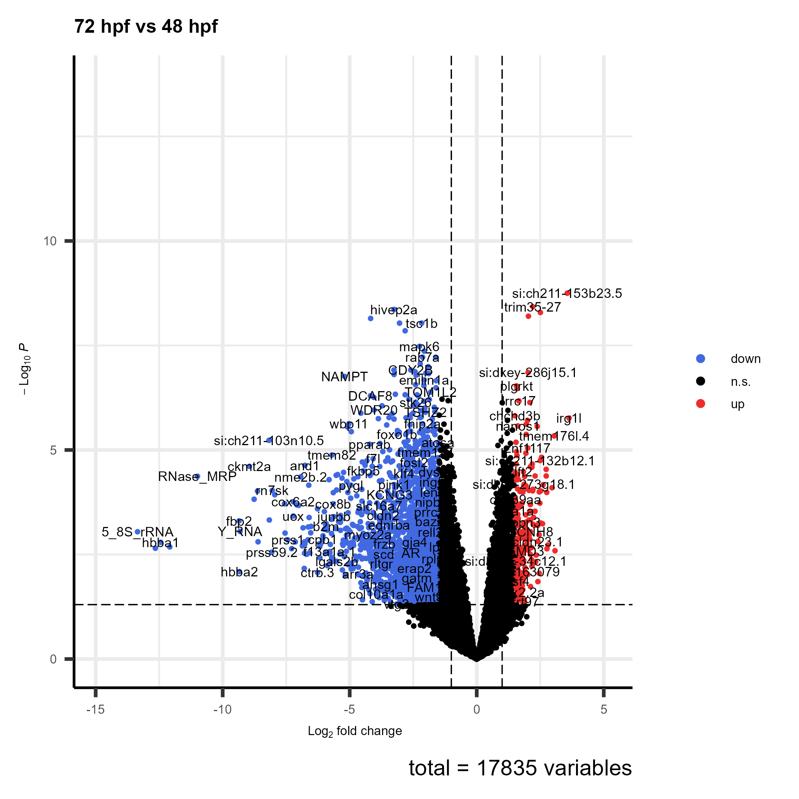
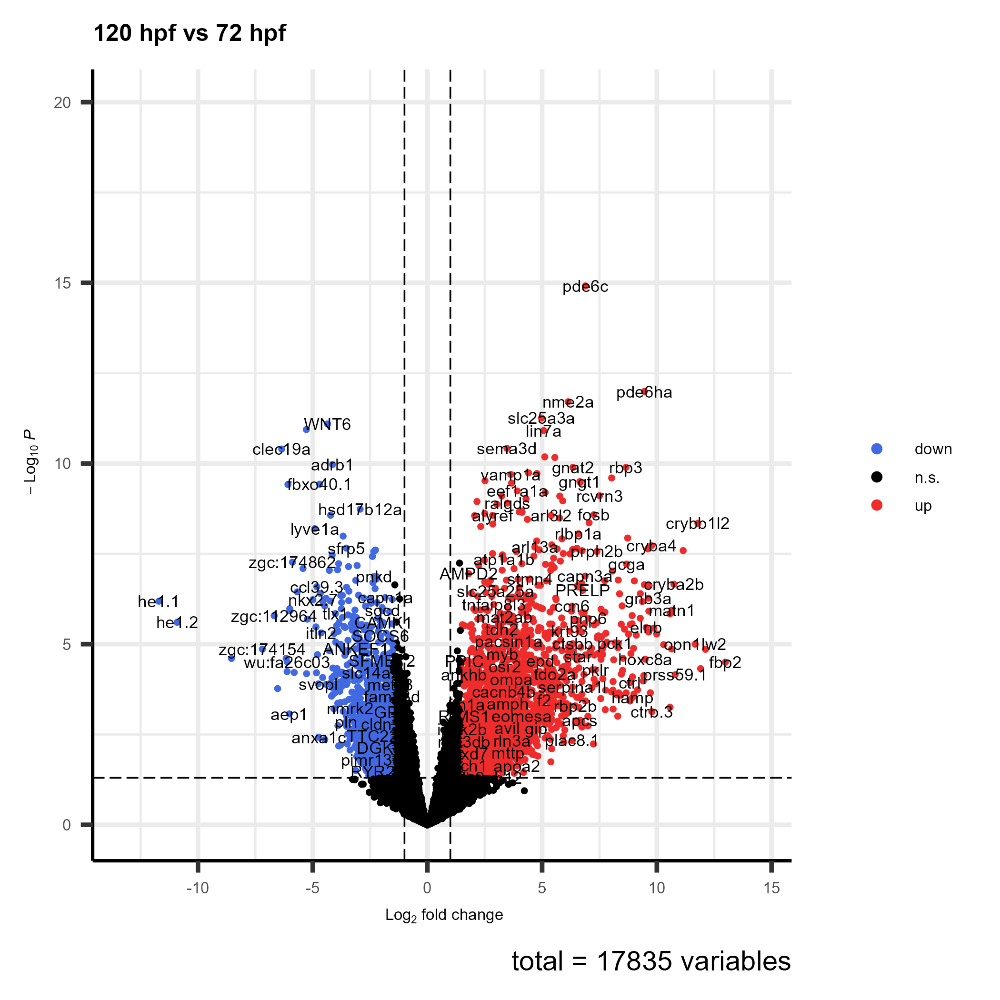
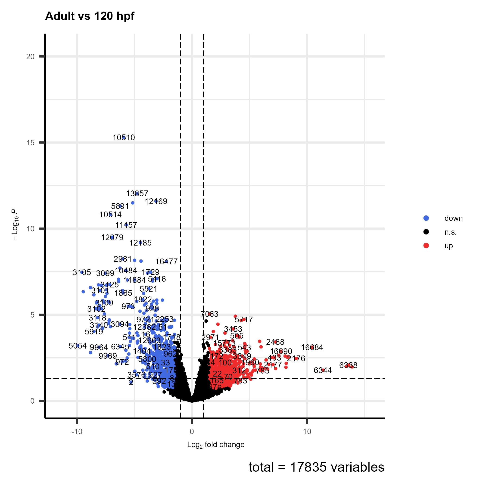
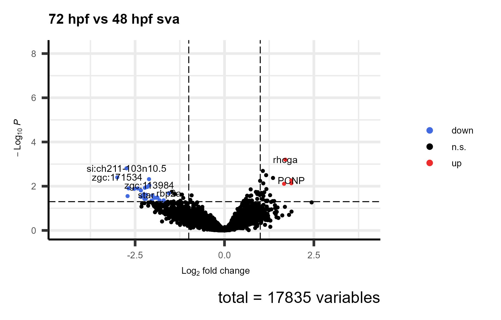
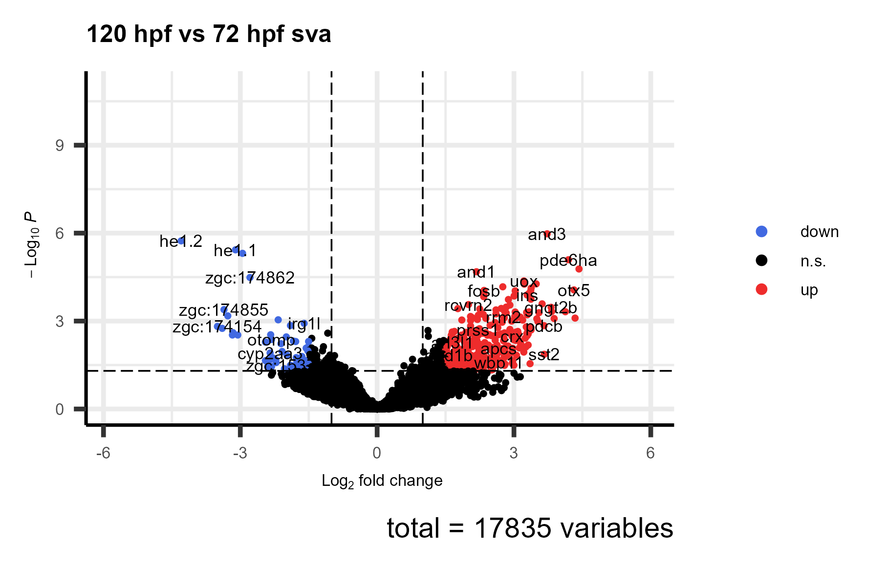
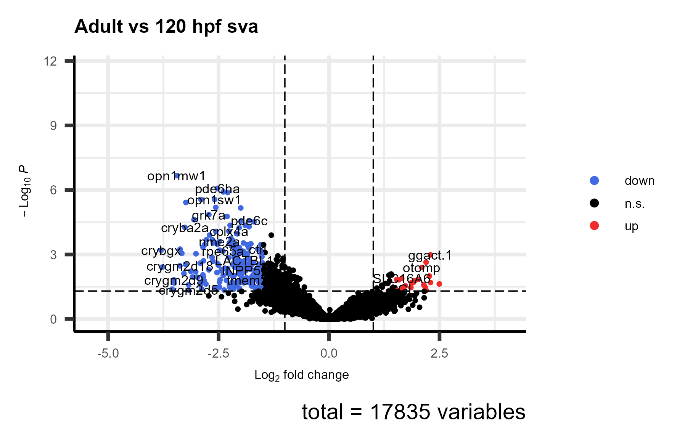
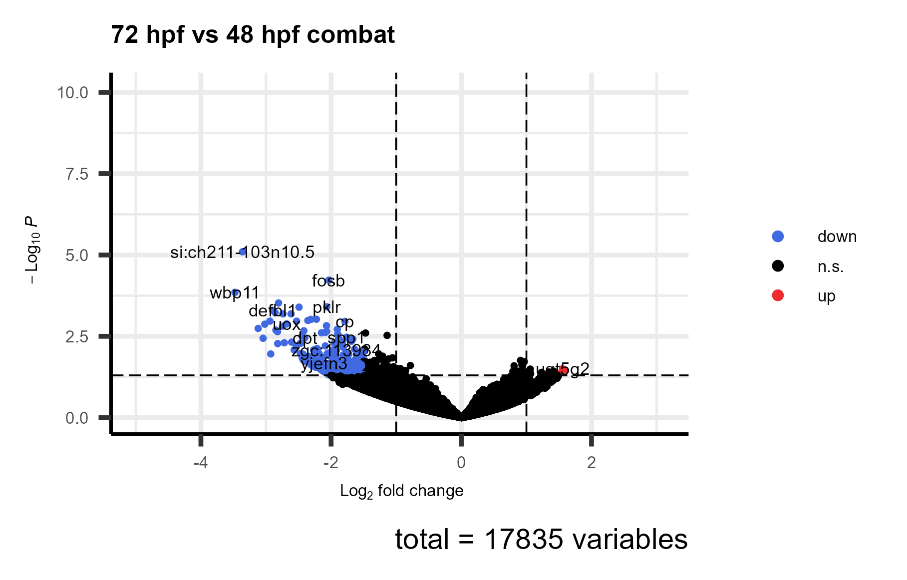
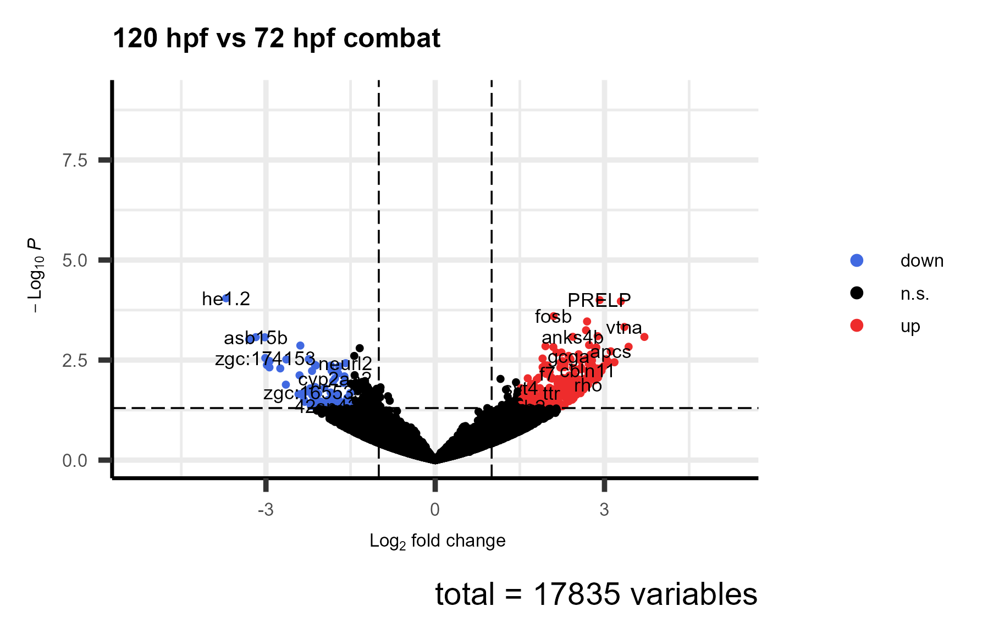
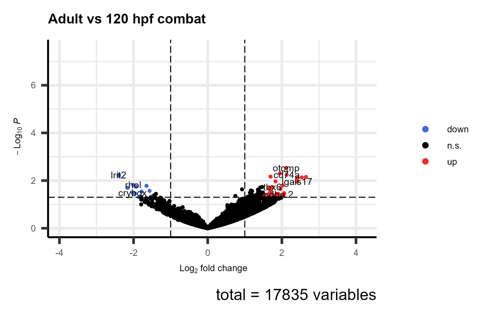

```{r setup, include=FALSE}
knitr::opts_chunk$set(echo = FALSE, out.width = "100%", message = FALSE)
```

```{r packages}
require(dplyr)
require(DT)
require(kableExtra)
require(tidyr)
require(knitr)
require(data.table)
```

# Expresión diferencial {.tabset}

```{r}
tabla <- function(table) {
  table$table %>%
  DT::datatable(extensions = 'Buttons',
                options = list(pageLength = 10,                
                             dom = 'Blfrtip',
                             order = list(list(1, 'asc')),
                             buttons = list('colvis', 
                                             list(title = NULL,
                                                  extend = list('copy'),
                                                  exportOptions = list(columns = ":visible"),
                                                  text = "Copy"),
                                             list(title = NULL,
                                                  extend = list('csv'),
                                                  exportOptions = list(columns = ":visible"),
                                                  text = ".csv"),
                                             list(title = NULL,
                                                  extend = list('excel'),
                                                  exportOptions = list(columns = ":visible"),
                                                  text = "Excel"),
                                             list(title = "Informe de los resultados en formato pdf",
                                                  extend = list('pdf'),
                                                  exportOptions = list(columns = ":visible"),
                                                  text = ".pdf"),
                                             list(title = NULL,
                                                  extend = list('print'),
                                                  exportOptions = list(columns = ":visible"),
                                                  text = "Print")
                                              )),
              filter = "top", 
              escape = FALSE, 
              rownames = TRUE)  %>%
  formatSignif(columns = c("logFC", "logCPM", "LR", "PValue", "FDR"), digits=3) %>%
  formatStyle('PValue', 
              fontWeight = styleInterval(0.05, c('bold', 'normal')), 
              color = styleInterval(0.05, c('green', 'black'))) %>%
  formatStyle('FDR', 
              fontWeight = styleInterval(0.05, c('bold', 'normal')), 
              color = styleInterval(0.05, c('green', 'black')))
}
```

## Estrategia control {.tabset}

### 72 hpf vs 48 hpf

```{r}
load("tt_72_48.RData")
tabla(tt_72_48)
```

```{r}

```

### 120 hpf vs 72 hpf

```{r}
load("tt_120_72.RData")
tabla(tt_120_72)
```

```{r}

```

### Adult vs 120 hpf

```{r}
load("tt_Adult_120.RData")
tabla(tt_adult_120)
```

```{r}

```

## SVA {.tabset}

### 72 hpf vs 48 hpf

```{r}
load("tt_72_48_sva.RData")
tabla(tt_72_48_sva)
```

```{r}

```

### 120 hpf vs 72 hpf

```{r}
load("tt_120_72_sva.RData")
tabla(tt_120_72_sva)
```

```{r}

```

### Adult vs 120 hpf

```{r}
load("tt_Adult_120_sva.RData")
tabla(tt_adult_120_sva)
```

```{r}

```

## ComBat {.tabset}

### 72 hpf vs 48 hpf

```{r}
load("tt_72_48_combat.RData")
tabla(tt_72_48_combat)
```

```{r}

```

### 120 hpf vs 72 hpf

```{r}
load("tt_120_72_combat.RData")
tabla(tt_120_72_combat)
```

```{r}

```

### Adult vs 120 hpf

```{r}
load("tt_Adult_120_combat.RData")
tabla(tt_adult_120_combat)
```

```{r}

```

# Número de genes{.tabset}

```{r}
# Genes upregulated en la estrategia control
n_ups_1_control <- length(which(tt_72_48$table$FDR < 0.05 & tt_72_48$table$logFC > 1.5))
n_ups_2_control <- length(which(tt_120_72$table$FDR < 0.05 & tt_120_72$table$logFC > 1.5))
n_ups_3_control <- length(which(tt_adult_120$table$FDR < 0.05 & tt_adult_120$table$logFC > 1.5))

# Genes downregulated en la estrategia control
n_downs_1_control <- length(which(tt_72_48$table$FDR < 0.05 & tt_72_48$table$logFC < -1.5))
n_downs_2_control <- length(which(tt_120_72$table$FDR < 0.05 & tt_120_72$table$logFC < -1.5))
n_downs_3_control <- length(which(tt_adult_120$table$FDR < 0.05 & tt_adult_120$table$logFC < -1.5))

# Genes upregulated con SVA
n_ups_1_sva <- length(which(tt_72_48_sva$table$FDR < 0.05 & tt_72_48_sva$table$logFC > 1.5))
n_ups_2_sva <- length(which(tt_120_72_sva$table$FDR < 0.05 & tt_120_72_sva$table$logFC > 1.5))
n_ups_3_sva <- length(which(tt_adult_120_sva$table$FDR < 0.05 & tt_adult_120_sva$table$logFC > 1.5))

# Genes downregulated con SVA
n_downs_1_sva <- length(which(tt_72_48_sva$table$FDR < 0.05 & tt_72_48_sva$table$logFC < -1.5))
n_downs_2_sva <- length(which(tt_120_72_sva$table$FDR < 0.05 & tt_120_72_sva$table$logFC < -1.5))
n_downs_3_sva <- length(which(tt_adult_120_sva$table$FDR < 0.05 & tt_adult_120_sva$table$logFC < -1.5))

# Genes upregulated con ComBat
n_ups_1_combat <- length(which(tt_72_48_combat$table$FDR < 0.05 & tt_72_48_combat$table$logFC > 1.5))
n_ups_2_combat <- length(which(tt_120_72_combat$table$FDR < 0.05 & tt_120_72_combat$table$logFC > 1.5))
n_ups_3_combat <- length(which(tt_adult_120_combat$table$FDR < 0.05 & tt_adult_120_combat$table$logFC > 1.5))

# Genes downregulated con ComBat
n_downs_1_combat <- length(which(tt_72_48_combat$table$FDR < 0.05 & tt_72_48_combat$table$logFC < -1.5))
n_downs_2_combat <- length(which(tt_120_72_combat$table$FDR < 0.05 & tt_120_72_combat$table$logFC < -1.5))
n_downs_3_combat <- length(which(tt_adult_120_combat$table$FDR < 0.05 & tt_adult_120_combat$table$logFC < -1.5))
```

## Estrategia Control

```{r}
ups_1 <- c(n_ups_1_control, n_ups_2_control, n_ups_3_control)
downs_1 <- c(n_downs_1_control, n_downs_2_control, n_downs_3_control)

tab_1 <- data.frame(ups_1, downs_1)
colnames(tab_1) <- c("Up", "Down")
rownames(tab_1) <- c("72 hpf vs 48 hpf", "120 hpf vs 72 hpf", "Adult vs 120 hpf")
datatable(tab_1)
```

## SVA

```{r}
ups_1 <- c(n_ups_1_sva, n_ups_2_sva, n_ups_3_sva)
downs_1 <- c(n_downs_1_sva, n_downs_2_sva, n_downs_3_sva)

tab_1 <- data.frame(ups_1, downs_1)
colnames(tab_1) <- c("Up", "Down")
rownames(tab_1) <- c("72 hpf vs 48 hpf", "120 hpf vs 72 hpf", "Adult vs 120 hpf")
datatable(tab_1)
```

## ComBat

```{r}
ups_1 <- c(n_ups_1_combat, n_ups_2_combat, n_ups_3_combat)
downs_1 <- c(n_downs_1_combat, n_downs_2_combat, n_downs_3_combat)

tab_1 <- data.frame(ups_1, downs_1)
colnames(tab_1) <- c("Up", "Down")
rownames(tab_1) <- c("72 hpf vs 48 hpf", "120 hpf vs 72 hpf", "Adult vs 120 hpf")
datatable(tab_1)
```


